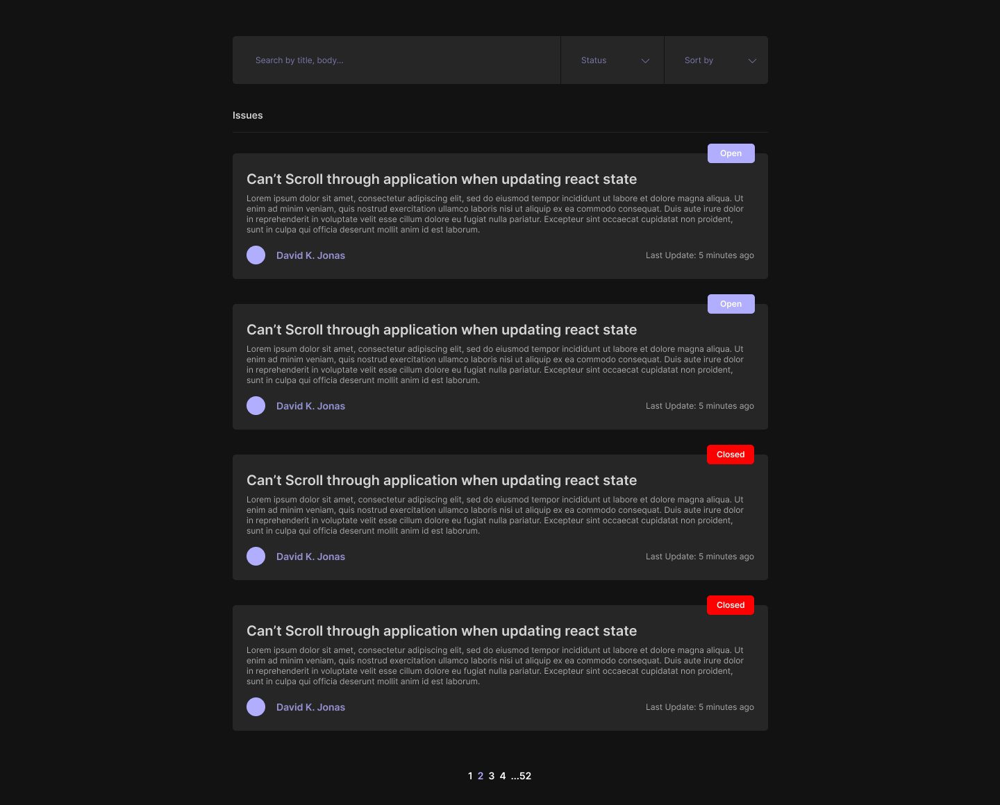

# Github Repos

This is a [Next.js](https://nextjs.org/) project bootstrapped with [`create-next-app`](https://github.com/vercel/next.js/tree/canary/packages/create-next-app).

## Getting Started

First, run the development server:

```bash
npm run dev
# or
yarn dev
```

Open [http://localhost:3000](http://localhost:3000) with your browser to see the result.
<br />
<br />

## Technological Stack

- React
- Typescript
- NextJS
- Apollo GraphQL
- Styled Components
- Day JS
<br />
<br />

## Proposed Design


<br />
<br />
## Requirements

### Browse issues in a repo page

Should show the list of issues, by default Open. Should paginate the list of issues and allow the filtering by open or closed state and by search term in the body or title of a issue.
### Issue details page

Issues page should have description from the issue, commentaries and user information from both the issue creator and the users that commented. Should also have the date of creation of the issue and from the commentaries, and allow pagination if there are many commentaries.
<br />
<br />

## Plan

### Browse Issues page

SSR initial page of issues on load, CSR next user iteration (pagination or issue choice).
Issues will be represented by cards that should have title, description (Up to 200 characters max), author (name, picture, url), status (Closed, Open).

Page state should be persisted in the URL
### Issue details page

SSR issue details + 3 comments if page is not a next redirect, if it is should be CSR'd. Issue number and comments page should be specified in url.
<br />
<br />
## Objective

Hability to have SSR and CSR in the same application. Should be able to delivery metadata and the correct html to search engines, have decent lighthouse score while keeping a SPA experience, with no white page/delays between navigations, use CSR for navigation between pages and SSR for hard reloads, keep state between navigation and keep ssr params in sync with csr (pagination, searchTerms and issue states) through apollo cache and url params.
